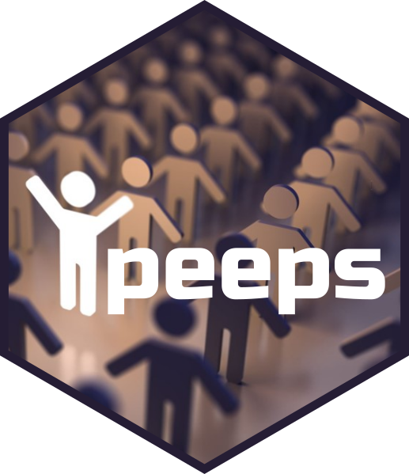

<!-- README.md is generated from README.Rmd. Please edit that file -->

```{r, include = FALSE}
knitr::opts_chunk$set(
  collapse = TRUE,
  comment = "#>",
  fig.path = "man/figures/README-",
  out.width = "100%"
)
```

# peeps 

<!-- badges: start -->
[](https://www.repostatus.org/#active)
[](https://github.com/mrc-ide/peeps/actions)
[](https://codecov.io/github/mrc-ide/peeps)
<!-- badges: end -->

Use 📦peeps📦 to prepare demography inputs for use with [malariasimulation](https://mrc-ide.github.io/malariasimulation/).

## Installation

You can install the  the development version from [GitHub](https://github.com/) with:

``` r
# install.packages("devtools")
devtools::install_github("mrc-ide/peeps")
```
