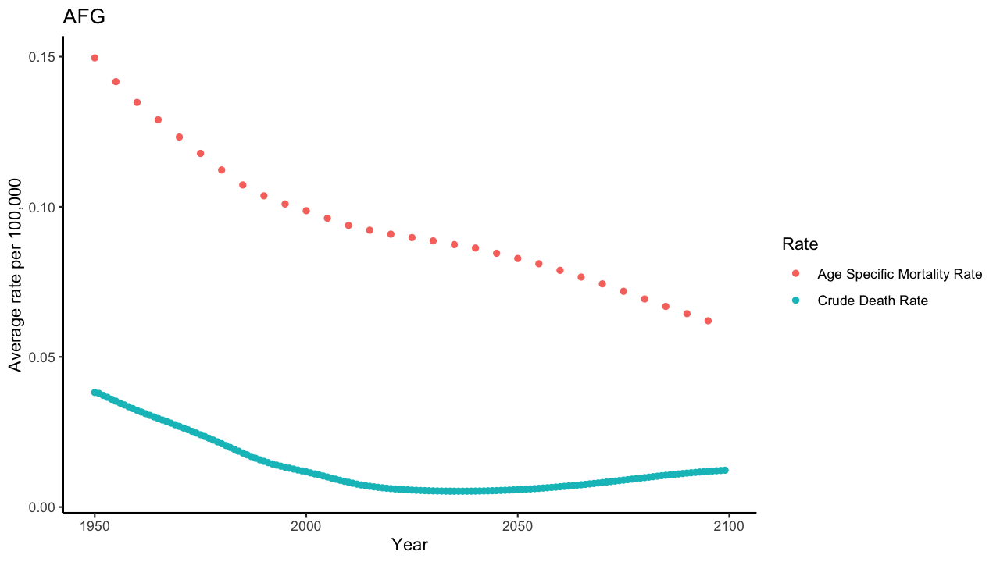
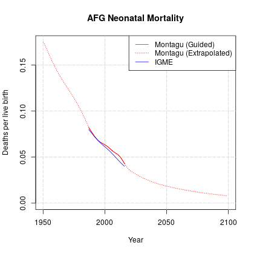

```{r, include = FALSE}
knitr::opts_chunk$set(
  collapse = TRUE,
  comment = "#>"
)
```

```{r setup}
library(peeps)
library(ggplot2)
library(dplyr)
library(tidyr)
library(magrittr)
library(gifski)
```


## Data Overview


The different mortality measures included in this package are as follows:

1. Population Mortality Rates
    + Age Specific Mortality Rates
    + Crude Death Rates 
2. Child Mortality Rates: 
    + Neonatal
    + Infant
    + Under-5 (Note - there are two different kinds and I need to make sure I'm referencing the right one here)
    
Although the mortality rate datasets included in this package might look similar, they have important differences that come with certain biases. This vignette sets to briefly outline some of these differences so that appropriate choices can be made when deciding which rates to use for what purposes, and how that might affect the outcome of any analysis. 


### Population Mortality

Data Set | Mortality Rate | Definition | Equation
------------- | ------------- | ------------- | -------------
asmr | Age specific mortality rate. | Measures incidence of death at each age, adjusted for population distributions. Assumes age-mortality profile of the cohort stays constant throughout life. Number of deaths every year at age x ($d_{x}$) divided by the mid year population of age x ($p_{x}$). | $m_{x} = \frac{d_{x}}{p_{x}}$
cdr | Crude death rate. | Number of deaths at age x ($d_{x}$) over a given period ($[0,T]$) divided by the person-years ($L_{x}$) lived by the population over that period. It is expressed as average annual number of deaths per 1,000 population. | $CDR[0,T] = \frac{d_{x}}{L_{x}}$ where $L_{x} = I_{x + 1} + d_{x}*0.5$.<br/><br/><small> $I_{x+1}$ are the number of people who survive until age x+1, who each contribute one person year to the calculation. Each person who dies in the interval ($d_{x}$) contributes half a person year.</small> 

The population level mortality rates provided by this package are taken from the model life tables calculated in the [United Nations 2019 World Population Prospects](https://population.un.org/wpp/) (UNWPP). More details on the model life tables and how they are calculated can be found [here](https://www.un.org/development/desa/pd/data/model-life-tables), and details on the UNWPP 2019 methodology can be found [here](https://population.un.org/wpp/Publications/Files/WPP2019_Methodology.pdf). These data are processed into a downloadable format by the [Vaccine Impact Modelling Consortium](https://www.vaccineimpact.org) (VIMC) at Imperial College London.


There are two standard measures of mortality: the age specific mortality rate (ASMR, also known as $m_{x}$, or the central rate of mortality) and the crude death rate (CDR), which is calculated using the total number of deaths at a certain age and the life table projections of person years lived. Given the variability in crude death numbers by year, cohort, random error/outliers/biases in reporting and measurement, and the underlying age distribution in a population, the ASMR is often used in order to compare mortality trends across times and countries. The ASMR takes an average over 5 year timespans and 5 year age groups, and adjusts for higher age distributions in populations. However, the ASMR is taken from a model life table, which is a theoretical tool used to model the mortality profile of a specific cohort over time, and thus assumes that this mortality profile remains constant throughout the life of the cohort. Therefore, the CDR can be helpful in providing a snapshot of a country's specific population profile at a given moment in time, and allows for the year over year variation in the differences in mortality by cohort.


```{r asmr}
# Investigating the details of the mortality rate data sets

# Call age specific mortality rates from peeps package
asmr <-peeps::asmr
dim(asmr) # 225720 rows by 8 columns
head(asmr)

cdr <- peeps::cdr
dim(cdr) # 17100 rows by 7 columns
head(cdr)

# Comparing the two values
summary(asmr$value)
summary(cdr$value)

```
```{r process data}
asmr<-peeps::asmr
cdr<-peeps::cdr

# Transforming data to inspect rates
asmr <- subset(asmr, asmr$gender == "both")
asmr<-subset(asmr, select=-c(country, age_to, gender))
cdr<-subset(cdr, select=-c(country, age_to, age_from, gender))

# Taking the mean of the ASMR over all age groups for comparison with CDR
new_asmr<-aggregate(value ~ country_code + year, data = asmr, mean, na.rm = TRUE)
colnames(new_asmr)[3] <- "Age Specific Mortality Rate"
colnames(cdr)[3]<-"Crude Death Rate"

rates<-dplyr::left_join(cdr, new_asmr, by = c("country_code", "year"))
rates<- rates %>%
  tidyr::pivot_longer(cols=c("Crude Death Rate", "Age Specific Mortality Rate"),
                      names_to="rate",
                      values_to="value")
```

```{r asmr plots, eval=FALSE}
# Making an animation of the plots of ASMR vs. CDR by country, using gifski package
makeplot <- function(){
  datalist <- split(rates, rates$country_code)
  lapply(datalist, function(data){
    p <- ggplot(data, aes(x=year, y=value)) +
      geom_point(aes(color=as.factor(rate))) +
      labs(y="Average rate per 100,000", x="Year", title=data$country_code, col="Rate") + 
      theme_classic()
    print(p)
  })
}
gif_file <- file.path('deathrates.gif')
save_gif(makeplot(), gif_file, 1280, 720, res = 144)
```


### Child Mortality Data

Data Set | Mortality Rate | Definition | Source
------------- | ------------- | ------------- | -------------
nmr | Neonatal mortality rate. | Probability of dying between birth and exact age 28 days. It is expressed as average annual deaths per 1,000 births. | VIMC (Combination of UNWPP and [IGME](https://childmortality.org/))
imr | Infant mortality rate. | Probability of dying between birth and exact age 1. It is expressed as average annual deaths per 1,000 births. | UNWPP
u5mr | Under-5 mortality rate. | Probability of dying between birth and exact age 5. It is expressed as average annual deaths per 1,000 births. | UNWPP

The UNWPP provides smoothed estimates of the IMR and the U5MR, however does not provide estimates of the NMR. The [UN Inter-agency Group for Child Mortality Estimation](https://childmortality.org/) provides much more detailed estimates of all past child mortality rates, including NMR, through a process of detailed data collection and careful model fitting, however does not provide any projections of the NMR into the future. The VIMC has therefore proposed an NMR estimate that is a scaled transformation of the UNWPP's IMR, multiplied by the fraction of NMR/IMR from the IGME. This calculation is justified by the fact that the NMR is a fraction of the IMR, and an assumption that this means that this relationship remains consistent over time. For estimates before or after the IGME time range, the closest data points are used. 

```{r child mrs}
# Quick look
nmr <-peeps::nmr
dim(nmr) 
head(nmr)

imr <- peeps::imr
dim(imr) 
head(imr)

u5mr <- peeps::u5mr
dim(u5mr) 
head(u5mr)

```

Below you can see a comparison of the VIMC fits (Montagu) do the IGME data and the extrapolation done informed by the UNWPP data by country.



