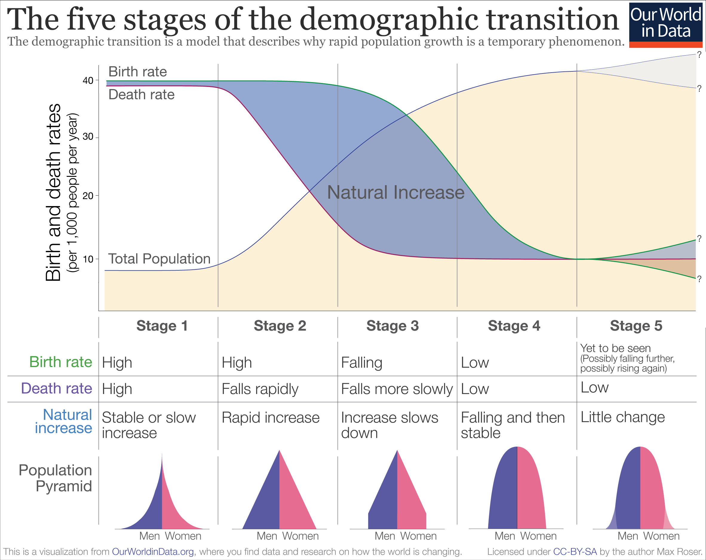
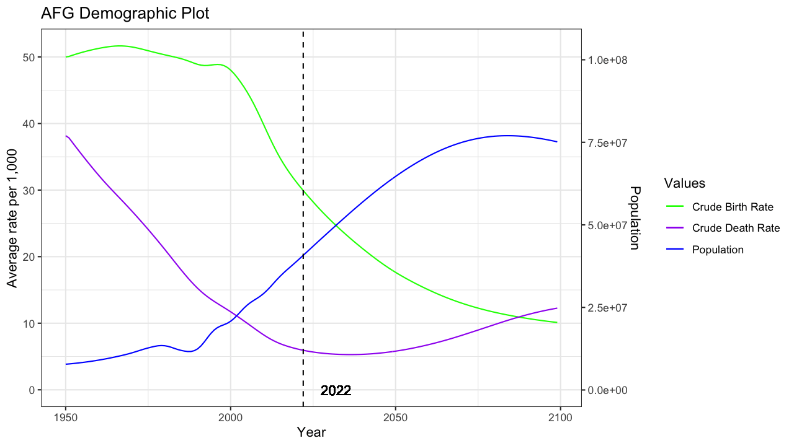
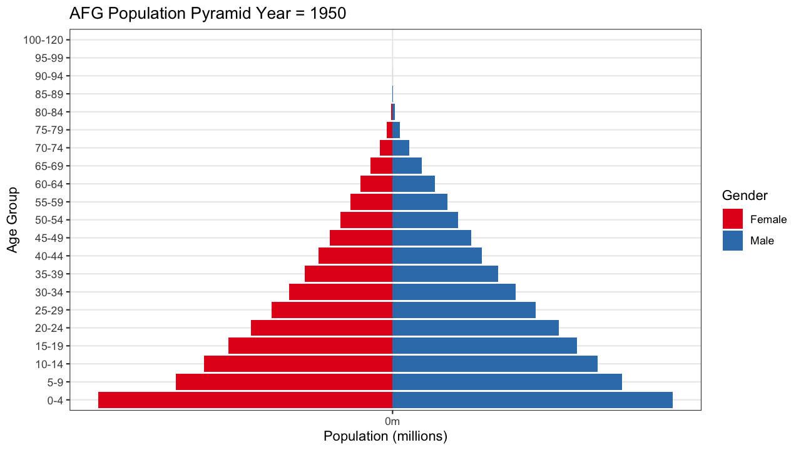

```{r , include = FALSE}
knitr::opts_chunk$set(
  collapse = TRUE,
  comment = "#>"
)
```

```{r setup}
library(peeps)
library(readxl)
library(ggplot2)
library(magrittr)
#library(gifski)
```

## Demographic Transition Model 

The Demographic Transition Model is one way demographers have conceptualized the relationship between economic growth and the subsequent changes in the population. Typically, it is illustrated using a graph of death and birth rates against population over time.




[Table source.](https://ourworldindata.org/world-population-growth)

This table illustrates the general structure of the Demographic Transition Model, and on the left hand side axis there are suggested values for what can be considered "high" and "low" birth and death rates ("high" being approximately >=40 per 1,000, "low" being approximately <= 10 per 1,000). While the rate of change in the rates can vary, the overall trend tends to be that deathrates fall first, then birth rates, and this results in a gradual population increase. A detailed explanation of this can be found at [Our World in Data.](https://ourworldindata.org/world-population-growth)

Most countries were in Stage 1 pre industrial revolution, and many of what are now called high income countries have experienced the falling and then stabilizing death and birth rates that characterize the progression through the stages. The rates fall often as a result of the stronger infrastructure, healthcare, and education that come through increased country net income. Countries can be categorized by stage in their demographic transition, often by looking at the rate of change of these rates relative to each other over time.

```{r data processing}
cdr <- peeps::cdr
cbr <- peeps::cbr
pop <- peeps::pop

cdr$value<-cdr$value*1000
cbr$value<-cbr$value*1000

names(cdr)[7]<-"deathrate"
names(cbr)[7]<-"birthrate"
names(pop)[7]<-"population"

rates<-merge(cdr, cbr)
rates <- subset(rates, select=-c(age_from, age_to))
pop<- subset(pop, select=-c(age_from, age_to))
all_data<-merge(rates, pop)

```

We can plot the crude birth rates, crude death rates, and total population count over time to visualize the observed and predicted demographic shifts for the countries in our dataset. The following code has been included to provide base code for demographic transition plots, and will not be run on knitting the markdown document.

```{r dtm plots, eval=FALSE}
# Making an animation of the demography plots
makeplot <- function(){
  datalist <- split(all_data, all_data$country_code)
  current_year <-format(Sys.Date(), "%Y")
  lapply(datalist, function(data){
    coeff <- max(data$population)/max(data$deathrate) # get scaling coefficient 
    p <- ggplot2::ggplot(data, aes(x=year)) +
    geom_line(aes(y=birthrate, color="Crude Birth Rate")) +
    geom_line(aes(y=deathrate, color="Crude Death Rate")) +
    geom_line(aes(y=population/coeff, color="Population")) +
    geom_vline(xintercept=as.numeric(current_year),linetype=2) +
    geom_text(aes(x=as.numeric(current_year)+10, label=current_year, y=0)) +
    scale_y_continuous(
      
      # Features of the first axis
      name = "Average rate per 1,000",
      
      # Add a second axis and specify its features
      sec.axis = sec_axis(~.*coeff, name="Population")
    ) +
    labs(x="Year", title=paste0(data$country_code, " Demographic Plot"), col="Values") +
    scale_color_manual(values = c(`Crude Birth Rate` = "green", `Crude Death Rate`= "purple", `Population` = "blue")) +
    theme_bw()
    print(p)
  })
}
gif_file <- file.path('dtm.gif')
gifski::save_gif(makeplot(), gif_file, 1280, 720, res = 144)

```




From the figures, it is apparent that the actual rates often vary from the modelling framework. 

The limitations of this model are that it was built looking specifically at countries in Europe, North America, and North East Asia, and so might not capture the full picture in other areas. Furthermore, it does not include mortality estimates from pandemics (such as the HIV pandemic), which in some areas have a larger impact on death rates than others. There is considerable variation in both the absolute values for the rates in addition to their rates of change across countries, which highlight the complexities of the systems of demographic change.


## Population Pyramids

In addition to demography plots, population pyramids are often used to determine what stage a country is in in its demographic transition. 

```{r pop processing}
pop_detail <- peeps::pop_detail

# Recode Age Groups
pop_detail$age_group<-paste0(pop_detail$age_from, "-", pop_detail$age_to)
pop_detail$age_group<-factor(pop_detail$age_group, 
                             levels=c("0-4","5-9","10-14","15-19","20-24",
                                "25-29","30-34","35-39","40-44","45-49",
                                "50-54","55-59","60-64","65-69","70-74",
                                "75-79","80-84","85-89","90-94","95-99",
                                "100-120"))

# Recoding gender in order to fit on plots
pop_detail$value<-ifelse(pop_detail$gender=="female", -pop_detail$value, pop_detail$value)
pop_detail$gender<-stringr::str_to_title(pop_detail$gender)
```

The following code has been included to provide base code for population pyramid plots, and will not be run on knitting the markdown document.

```{r pyrplot, eval=FALSE}
# get the population of afghanistan
pop_afg<-subset(pop_detail, pop_detail$country_code == "AFG" & pop_detail$year >=1950)

# Making an animation of the demography plots
makepyrplot <- function(){
  datalist <- split(pop_afg, pop_afg$year)
  lapply(datalist, function(data){
    p <-ggplot(data, aes(x = age_group, y = value, fill = gender)) + 
        geom_bar(data=subset(data, gender == "Female"), stat = "identity") + 
        geom_bar(data=subset(data, gender == "Male"), stat = "identity") +
        scale_y_continuous(breaks = seq(-4000000, 4000000, 1000000), 
                           labels = paste0(as.character(c(4:0, 1:4)), "m")) + 
        coord_flip() + 
        scale_fill_brewer(palette = "Set1") + 
        labs(x="Age Group", title=paste0("AFG Population Pyramid Year = ",data$year),y="Population (millions)", fill="Gender") +
        theme_bw()
    print(p)
  })
}
gif_file <- file.path('afg_pyramid.gif')
gifski::save_gif(makepyrplot(), gif_file, 1280, 720, res = 144)

```


These population pyramids help us to look at the changing underlying age distribution of the population. In the case of Afghanistan, you see that the population increases with a time lag after the death rate falls, and then the population pyramid takes on a bell shape with a smaller population of children than adults as the birth rate falls. The bell curve shape starts after around 2020, which is shaded in blue on the pyramid graph.

```{r plot ex afg, fig.height = 5, fig.width = 9, fig.align = "center"}
# Plotting single DTM plot for Afghanistan
afg_data<-subset(all_data, all_data$country_code =="AFG")
coeff <- max(afg_data$population)/(max(afg_data$deathrate)) # get scaling coefficient 

p <- ggplot2::ggplot(afg_data, aes(x=year)) +
    annotate(geom="rect", xmin=2020, xmax=Inf, ymin=-Inf, ymax=Inf, fill="blue", alpha=0.2) +
    geom_line(aes(y=birthrate, color="Crude Birth Rate")) +
    
    geom_line(aes(y=deathrate, color="Crude Death Rate")) +
    geom_line(aes(y=population/coeff, color="Population")) +
    
    geom_vline(xintercept=2020,linetype=2) +
    geom_text(aes(x=2030, label=2020, y=0)) +
    
    scale_y_continuous(
      
      # First axis
      name = "Average rate per 1,000",
      
      # Second axis and specify its features
      sec.axis = sec_axis(~.*coeff, name="Population")
    ) +
    
    labs(x="Year", title=paste0(afg_data$country_code, " Demographic Plot"), col="Values") +
    scale_color_manual(values = c(`Crude Birth Rate` = "green", `Crude Death Rate`= "purple", `Population` = "blue")) +
    theme_bw()

p
  
```

## Example: Variation by Income Group

Let's take a deeper look at examples stratified by income group, all when year = 2020.


### Low Income: Congo 

#### Demographic Transition Plot

```{r ex:congo.dtm, fig.height = 5, fig.width = 8, fig.align = "center", echo=FALSE}
con_data<-subset(all_data, all_data$country =="Congo")
coeff <- max(con_data$population)/(max(con_data$deathrate)) # get scaling coefficient 

dtmplot <- ggplot2::ggplot(con_data, aes(x=year)) +
    annotate(geom="rect", xmin=2020, xmax=Inf, ymin=-Inf, ymax=Inf, fill="blue", alpha=0.2) +
    geom_line(aes(y=birthrate, color="Crude Birth Rate")) +
    
    geom_line(aes(y=deathrate, color="Crude Death Rate")) +
    geom_line(aes(y=population/coeff, color="Population")) +
    
    geom_vline(xintercept=2020,linetype=2) +
    geom_text(aes(x=2030, label=2020, y=0)) +
    
    scale_y_continuous(
      
      # First axis
      name = "Average rate per 1,000",
      
      # Second axis and specify its features
      sec.axis = sec_axis(~.*coeff, name="Population")
    ) +
    
    labs(x="Year", title=paste0(con_data$country_code, " Demographic Plot"), col="Values") +
    scale_color_manual(values = c(`Crude Birth Rate` = "green", `Crude Death Rate`= "purple", `Population` = "blue")) +
    theme_bw()

dtmplot 
```

Here we see the birth and death rates still falling sharply. They are projected to continue to fall, albeit it at a slower rate, past 2020.

#### Pyramid Plot

```{r ex:congo.pyramid, fig.height = 5, fig.width = 8, fig.align = "center", echo=FALSE}
pop_con<-subset(pop_detail, pop_detail$country_code == "COG" & pop_detail$year ==2020)


pyrplot <-ggplot2::ggplot(pop_con, aes(x = age_group, y = value, fill = gender)) + 
        geom_bar(data=subset(pop_con, gender == "Female"), stat = "identity") + 
        geom_bar(data=subset(pop_con, gender == "Male"), stat = "identity") +
        scale_y_continuous(breaks = seq(-1000000, 1000000, 100000), 
                           labels = paste0(as.character(c(10:0, 1:10)))) + 
        coord_flip() + 
        scale_fill_brewer(palette = "Set1") + 
        labs(x="Age Group", title=paste0("CON Population Pyramid Year = ",pop_con$year),y="Population (hundred thousands)", fill="Gender") +
        theme_bw()
pyrplot
```

The population pyramid of the Congo is still relatively bottom heavy, reflecting the low life expectancy and high death rate of the country.

### Lower Middle Income: Cambodia

#### Demographic Transition Plot
```{r ex:cambodia.dtm, fig.height = 5, fig.width = 8, fig.align = "center", echo=FALSE}
cam_data<-subset(all_data, all_data$country =="Cambodia")
coeff <- max(cam_data$population)/(max(cam_data$deathrate)) # get scaling coefficient 

dtmplot <- ggplot2::ggplot(cam_data, aes(x=year)) +
    annotate(geom="rect", xmin=2020, xmax=Inf, ymin=-Inf, ymax=Inf, fill="blue", alpha=0.2) +
    geom_line(aes(y=birthrate, color="Crude Birth Rate")) +
    
    geom_line(aes(y=deathrate, color="Crude Death Rate")) +
    geom_line(aes(y=population/coeff, color="Population")) +
    
    geom_vline(xintercept=2020,linetype=2) +
    geom_text(aes(x=2030, label=2020, y=0)) +
    
    scale_y_continuous(
      
      # First axis
      name = "Average rate per 1,000",
      
      # Second axis and specify its features
      sec.axis = sec_axis(~.*coeff, name="Population")
    ) +
    
    labs(x="Year", title=paste0(cam_data$country_code, " Demographic Plot"), col="Values") +
    scale_color_manual(values = c(`Crude Birth Rate` = "green", `Crude Death Rate`= "purple", `Population` = "blue")) +
    theme_bw()

dtmplot 
```

Cambodia has already experienced a sharp drop in both death and birth rates, which is reflected in its increased population in those aged under 40 relative to the age groups above 40. The population is expected to sharply increase and then level off once the new generation experiencing lower death rates starts to hit adulthood.

#### Pyramid Plot

```{r ex:cambodia.pyramid, fig.height = 5, fig.width = 8, fig.align = "center", echo=FALSE}
pop_cam<-subset(pop_detail, pop_detail$country== "Cambodia" & pop_detail$year ==2020)


pyrplot <-ggplot2::ggplot(pop_cam, aes(x = age_group, y = value, fill = gender)) + 
        geom_bar(data=subset(pop_cam, gender == "Female"), stat = "identity") + 
        geom_bar(data=subset(pop_cam, gender == "Male"), stat = "identity") +
        scale_y_continuous(breaks = seq(-1000000, 1000000, 100000), 
                           labels = paste0(as.character(c(10:0, 1:10)))) + 
        coord_flip() + 
        scale_fill_brewer(palette = "Set1") + 
        labs(x="Age Group", title=paste0("CAM Population Pyramid Year = ",pop_cam$year),y="Population (hundred thousands)", fill="Gender") +
        theme_bw()
pyrplot
```

### Upper Middle Income: South Africa

#### Demographic Transition Plot

```{r ex:south africa.dtm, fig.height = 5, fig.width = 8, fig.align = "center", echo=FALSE}
sa_data<-subset(all_data, all_data$country =="South Africa")
coeff <- max(sa_data$population)/(max(sa_data$deathrate)) # get scaling coefficient 

dtmplot <- ggplot2::ggplot(sa_data, aes(x=year)) +
    annotate(geom="rect", xmin=2020, xmax=Inf, ymin=-Inf, ymax=Inf, fill="blue", alpha=0.2) +
    geom_line(aes(y=birthrate, color="Crude Birth Rate")) +
    
    geom_line(aes(y=deathrate, color="Crude Death Rate")) +
    geom_line(aes(y=population/coeff, color="Population")) +
    
    geom_vline(xintercept=2020,linetype=2) +
    geom_text(aes(x=2030, label=2020, y=0)) +
    
    scale_y_continuous(
      
      # First axis
      name = "Average rate per 1,000",
      
      # Second axis and specify its features
      sec.axis = sec_axis(~.*coeff, name="Population")
    ) +
    
    labs(x="Year", title=paste0(sa_data$country_code, " Demographic Plot"), col="Values") +
    scale_color_manual(values = c(`Crude Birth Rate` = "green", `Crude Death Rate`= "purple", `Population` = "blue")) +
    theme_bw()

dtmplot 
```

#### Pyramid Plot

South Africa has already experienced a levelling off of death and birth rates with the requisite population boom. Although it has a marked bell shape, the population size is projected to increase more gradually compared to previously.

```{r ex:south africa.pyramid, fig.height = 5, fig.width = 8, fig.align = "center", echo=FALSE}
pop_sa<-subset(pop_detail, pop_detail$country== "South Africa" & pop_detail$year ==2020)


pyrplot <-ggplot2::ggplot(pop_sa, aes(x = age_group, y = value, fill = gender)) + 
        geom_bar(data=subset(pop_sa, gender == "Female"), stat = "identity") + 
        geom_bar(data=subset(pop_sa, gender == "Male"), stat = "identity") +
        scale_y_continuous(breaks = seq(-4000000, 4000000, 1000000), 
                           labels = paste0(as.character(c(4:0, 1:4)), "m")) + 
        coord_flip() + 
        scale_fill_brewer(palette = "Set1") + 
        labs(x="Age Group", title=paste0("ZAF Population Pyramid Year = ",pop_cam$year),y="Population (m)", fill="Gender") +
        theme_bw()
pyrplot
```

In these examples, it is clear that as country income increases, the fatter the bottom half of the population pyramid, and thus the further along they are in their demographic transition.
